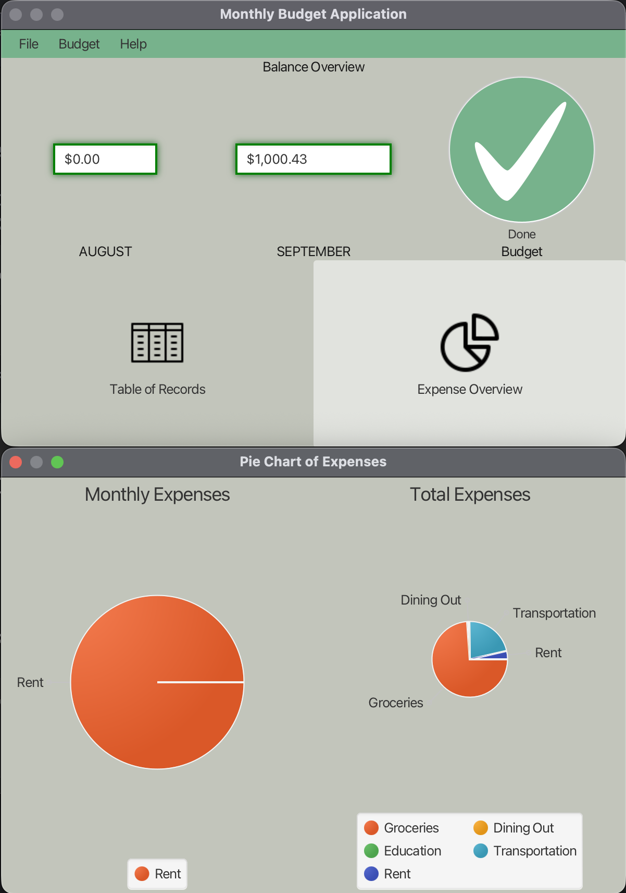
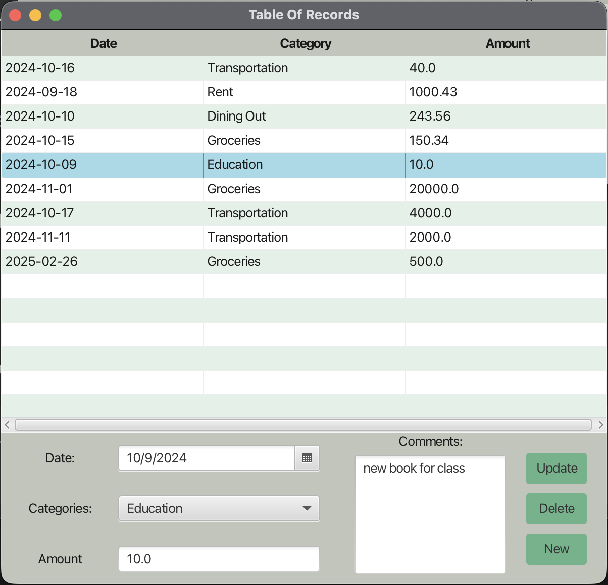

# JavaFX Expense Tracker

A desktop application to track monthly expenses and budgets. Built with **JavaFX** using an MVC design pattern.  

## Features
- Add, edit, and delete transactions (date, category, amount, comment)  
- Set and monitor monthly budget with progress indicator  
- View last month’s balance, this month’s balance, and budget usage  
- Table view with sorting and filtering  
- Expense overview with interactive pie charts (current month + all time)  
- Keyboard shortcuts for quick navigation  

## Tech Stack
- Java 17+
- JavaFX
- Maven

## Requirements
- JDK 22 (or JDK 21 + set `javafx.version` to a 21.x release)
- Maven 3.9+

## How to Run
1. Clone the repository:
   ```bash
   git clone https://github.com/hbp23/javafx-expense-tracker.git
   cd javafx-expense-tracker
   mvn clean javafx:run
   # or: mvn -Dprism.order=sw javafx:run (if no GPU)

## Screenshots


Screenshots live in `docs/screenshots/`.

## Application Walkthrough

### Main Application
- **Top Row**
  - File: open Table of Records (Alt+T), Expense Overview (Alt+P), or Exit  
  - Budget: set monthly budget (Alt+B)  
  - Help: keyboard shortcuts (Alt+H)  
- **Middle Row**
  - Left: last month’s balance  
  - Middle: current month’s balance  
  - Right: budget progress indicator  
- **Bottom Row**
  - Table of Records: view, add, update, delete transactions  
  - Expense Overview: pie charts by category (monthly and all-time)  

### Table of Records
- View, sort, and filter transactions (Date, Category, Amount)  
- Add, edit, delete transactions  
- Add optional comments  
- “New” button clears selection  

### Expense Overview
- Left pie: this month’s expenses by category  
- Right pie: all-time expenses by category  
- Both include legends  

---

## License
MIT License – see [LICENSE](LICENSE) for details.
